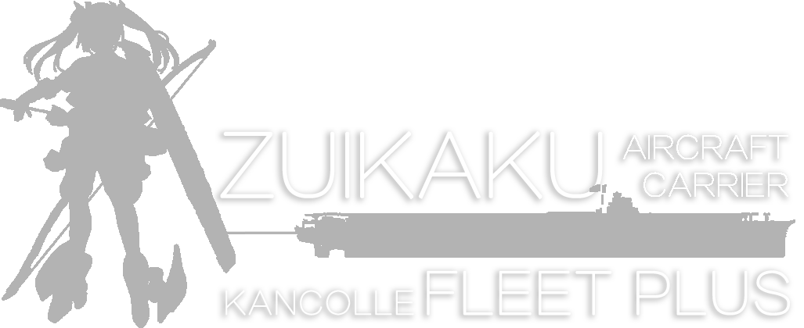

---------------------------------------------
(Project in early development stage)

View Kantai Collection Wiki Offine with modern UI, full user interactions, and all personalized information!

## Install
For the development version, run 

`npm install` 

`npm start`

To start the applicaiton

## Features
__Cross platform Desktop Application__ With the power of Electron, ZF+ can run on Windows, Linux, and MacOS.

__Material UI__ ZF+ implements Material Design Lite and uses fully materialized components. 

__Various Widgets__ Other than the game Wiki data, ZF+ will have plenty of widget tools integrated, which can make your gaming experience much easier. 

__Offline__ Most of the components and data can be stored locally, which means most functionalities will work even without Internet connections. 

